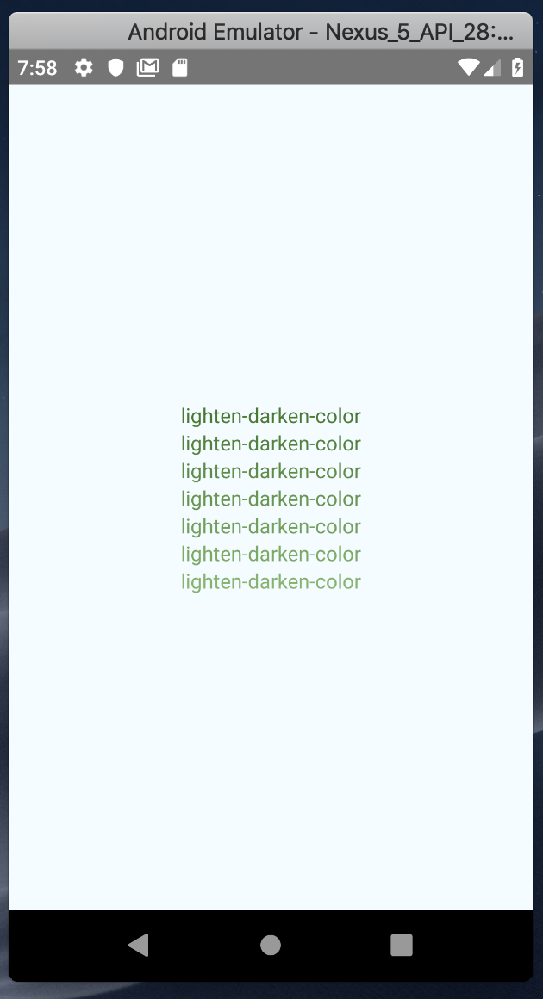

# **Lighten Darken Color**

This is a simple JavaScript helper which allow you darken or lighten a colors in your application.  This function takes colors in hex format (i.e. #F06D06, with or without hash) and lightens or darkens them with a value.




### Installation

Add lighten-darken-color to your project by executing

```javascript
$  npm install lighten-darken-color
or
$ yarn add lighten-darken-color
```


> and that's it, you're all good to go!


### Tested Platform

`lighten-darken-color` is just a javascript function and should work in any javascript project or framework. But here are a list of framework we've tested `lighten-darken-color` with, and yes it works fine!

- React Native
- Reactjs
- Vuejs

### Usage

Make sure to import the package into your project

```javascript
/**
 * Sample React Native App
 * https://github.com/facebook/react-native
 *
 * @format
 * @flow
 */

import React, {Component} from 'react';
import { StyleSheet, Text, View} from 'react-native'; 
import { LightenDarkenColor } from 'lighten-darken-color'; 
 
type Props = {};
export default class App extends Component<Props> {
   render() {
    return (
      <View style={styles.container}>
             <Text style={{color:LightenDarkenColor('#3F6D2A', 10)}}> lighten-darken-color </Text>
             <Text style={{color:LightenDarkenColor('#3F6D2A', 40)}}> lighten-darken-color </Text>
             <Text style={{color:LightenDarkenColor('#3F6D2A', 60)}}> lighten-darken-color </Text>
             <Text style={{color:LightenDarkenColor('#3F6D2A', 80)}}> lighten-darken-color </Text>
             <Text style={{color:LightenDarkenColor('#3F6D2A', 100)}}> lighten-darken-color </Text>
             <Text style={{color:LightenDarkenColor('#3F6D2A', 140)}}> lighten-darken-color </Text>
             <Text style={{color:LightenDarkenColor('#3F6D2A', 180)}}> lighten-darken-color </Text>
      </View>
    );
  }
}

const styles = StyleSheet.create({
  container: {
    flex: 1,
    justifyContent: 'center',
    alignItems: 'center',
    backgroundColor: '#F5FCFF',
  } 
});

```


## API's

| Name                              | Use                                                          | Default Values |
| --------------------------------- | ------------------------------------------------------------ | -------------- |
| LightenDarkenColor(color, amount) | define the color and the amount you'd like the increase or reduce | None           |

  

## Licensing

This project is licensed under MIT license.


### Don't forget to star, like and share :)

